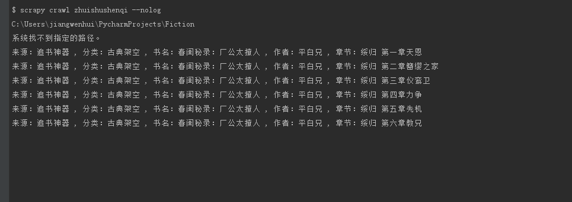
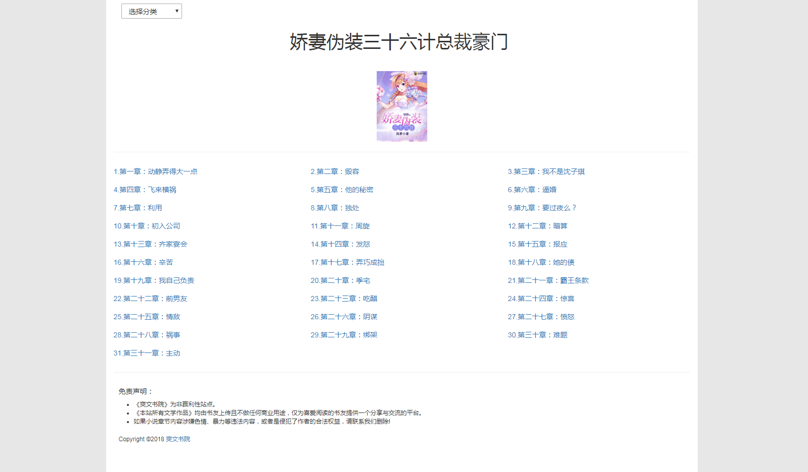
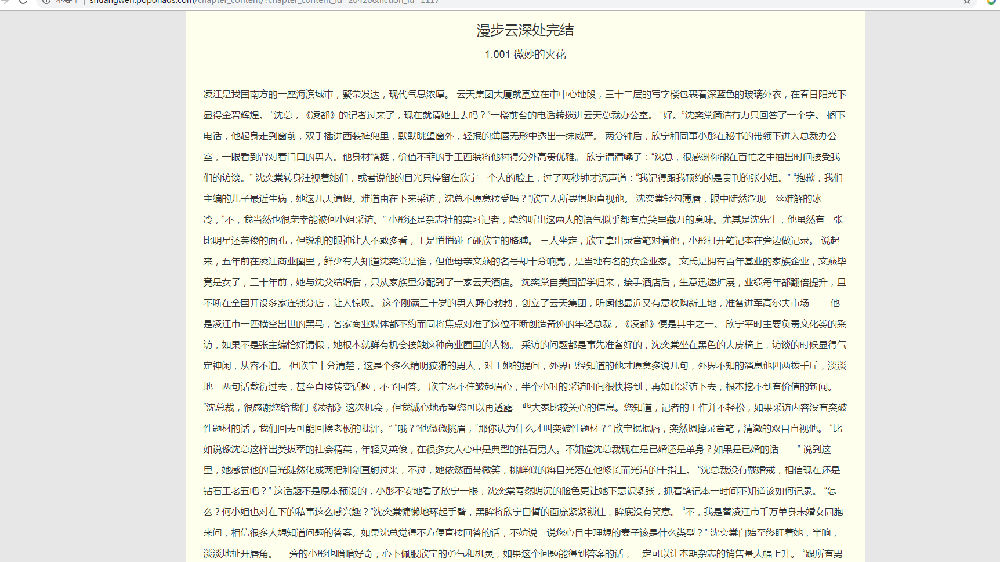
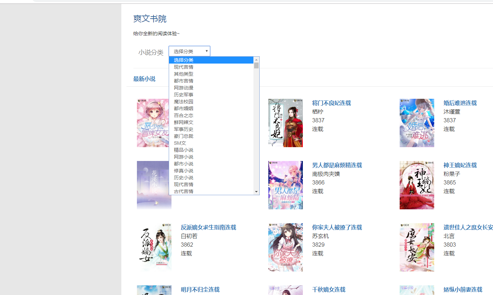

用scrapy框架爬虫爬取小说导入数据库并用django框架搭建自己的小说网站
==== 

爬虫项目目录
-------  
Fiction/app01/fiction_scrapy

安装依赖模块：
-------  
    pip3 install -r requirements.txt

爬虫启动命令:
-------  
    cd Fiction/app01/fiction_scrapy/fiction_scrapy/spiders && scrapy crawl <scrapy爬虫name> --nolog

截图示例
-------  

小说网站启动命令（启动前先修改数据库配置文件settings.py同步数据库 ）：
-------  
    python3 manage.py makemigrations
    python3 manage.py migrate
    python3 manage.py runserver 0:8000

下面是截图
-------  

